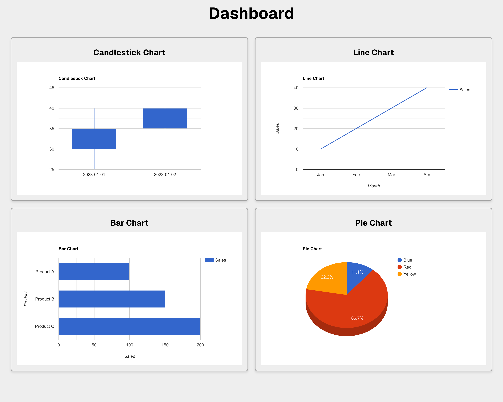

# Chart Dashboard with Next.js and Django API

This project contains two parts:
1. **Backend**: A Django API that provides chart data.
2. **Frontend**: A Next.js application that displays the chart data using Google Charts.

## Project Structure

```
/APIService               # Django backend
  /APIService             # Django settings, urls, and configurations
    __init__.py
    asgi.py
    settings.py
    urls.py
    wsgi.py
  /__pycache__
  /migrations
    __init__.py
  apps.py
  tests.py
  urls.py
  views.py
  manage.py
  requirements.txt
  .env                    # Environment variables
  Dockerfile              # Docker setup for Django API

/chart-dashboard-ui       # Next.js frontend
  /src
    /component            # Chart components (Bar, Line, Pie, Candlestick)
  .env                    # Environment variables
  .eslintrc.json          # ESLint config
  Dockerfile              # Docker setup for Next.js app
  next.config.mjs
  package.json
  tsconfig.json
docker-compose.yml        # Docker-compose to run both backend and frontend services
README.md                 # Instructions for running the project
```

## How to Set Up and Run the Application

### Prerequisites
- Docker and Docker Compose installed on your system.
- Ensure that ports `8000` and `3000` are available (used for the Django API and Next.js frontend, respectively).

### Step 1: Clone the repository

```bash
git clone <repository-url>
cd <repository-directory>
```

### Step 2: Build and run the application using Docker

Run the following command to start both the Django API and the Next.js frontend:

```bash
docker-compose up --build
```

This will:
1. Build the Django API and Next.js applications.
2. Start both services on their respective ports:
   - Django API: [http://localhost:8000](http://localhost:8000)
   - Next.js frontend: [http://localhost:3000](http://localhost:3000)

### Step 3: Access the Application

- Open your browser and visit [http://localhost:3000](http://localhost:3000) to view the chart dashboard.
- The dashboard includes four types of charts: Bar, Line, Pie, and Candlestick, all fetching data from the Django API.

### Step 4: Stop the Application

To stop the running containers, press `Ctrl+C` in the terminal where the containers are running.

You can remove the containers, networks, and volumes created by Docker Compose by running:

```bash
docker-compose down
```

## Libraries and Tools Used

### Backend (Django API)
- **Django**: A high-level Python web framework for building the backend API.
- **Django REST Framework**: To build and handle the API endpoints.
- **Python 3.10**: The backend is written in Python.
- **Docker**: The Django app is containerized for easy deployment.

### Frontend (Next.js)
- **Next.js**: A React framework for building the frontend application.
- **TypeScript**: The frontend code uses TypeScript for type safety.
- **React Google Charts**: Used for rendering charts on the frontend.
- **Docker**: The Next.js app is containerized for easy deployment.

### Other Tools
- **Docker Compose**: Used to orchestrate the services and run the frontend and backend together.

## Explanation of the Approach and Thought Process

1. **Backend Setup**:
   - I began by setting up the backend using Django. The backend serves four REST API endpoints, each returning hardcoded data required for different charts (Bar, Line, Pie, and Candlestick).
   - The Django REST Framework was used to create these APIs, which provide data in JSON format. After developing the APIs, I used **Postman** to test and ensure they return the correct responses and handle errors gracefully. This allowed me to verify the endpoints interact correctly with the frontend.

2. **Frontend Setup**:
   - Once the backend was functional, I moved on to setting up the frontend using the Next.js framework, which allows for efficient server-side rendering and provides a smooth development experience.
   - For visualizing the data, I utilized the **React Google Charts** library, which integrates easily with Next.js and provides an array of chart options that I used to render the Bar, Line, Pie, and Candlestick charts dynamically based on API data.
3. **Docker Integration**:
   - Finally, I set up Docker for both the backend (Django API) and the frontend (Next.js app). Using Docker ensures that the application can run consistently across different environments. I also used **Docker Compose** to orchestrate both services, allowing for easy setup and management of both the backend and frontend simultaneously.
   
4. **Error Handling and Timeout**:
   - In case of network issues, I implemented a timeout mechanism where the API request would fail if no response was received within 3 seconds. If a timeout or any other error occurs, the application displays a message indicating the issue.
   - To improve user experience, I added a **refresh button** that allows users to retry the failed API request and refresh the chart data dynamically without needing to reload the entire page.


## Screenshot

Below is a screenshot of the chart dashboard displaying various chart types:


